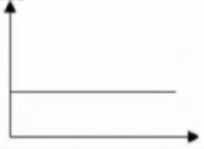
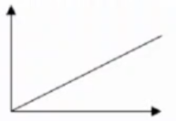
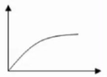
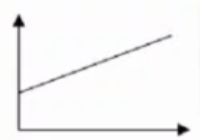
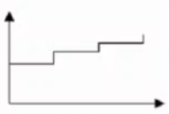

# Ejercicios tema 2

## `Ejercicio 4`: costes variables

Clasificar los costes ^^de una consultoría^^ según su **variabilidad**

|Concepto|Tipo|
|--|--|
|Consumos de material de oficina e informático|`Fijo`|
|Sueldos y seguridad social del personal de administración y dirección|`Fijo`|
|Dietas de los consultores en sus visitas a los clientes|`Variable`|
|Descuentos comerciales concedidos a clientes|**No es un coste, es menor importe de venta** {: .red}|
|Dietas del director general|`Fijo`|
|Costes de locomoción|`Variable`|
|Gas|`Semivariable` (igual se puede considerar `Variable` porque la parte fija es despreciable)|
|Subcontratación de estudios a terceros|`Variable`|
|Publicidad|`Fijo`|
|Electricidad|`Semivariable`|
|Teléfono|`Semivariable`, *Realmente depende de la tarifa telefónica*|
|Página Web|`Fijo`|
|Servicios de prensa|`Fijo`|
|Sueldos y seguridad social de los consultores|`Semifijo`|
|Sueldos por horas extras de los consultores|`Variable`|
|Costes varios|`Fijo`|
|Alquiler|`Fijo`|
|Amortización ordenadores|`Fijo`|

## `Ejercicio 5`: representación gráfica de costes

1. Amortización del edificio lineal en 35 años.  
2. Sueldos de los trabajadores contratados a través de empresas de trabajo temporal (ETT)  
3. Materias primas consumidas sobre las que se practica un rappel. El porcentaje del rappel se incrementa en función del volumen  
4. Salarios de lo strabajadores con remuneración constante en función de la producción, con salario mínimo.  
5. Amortización del utillaje.  
