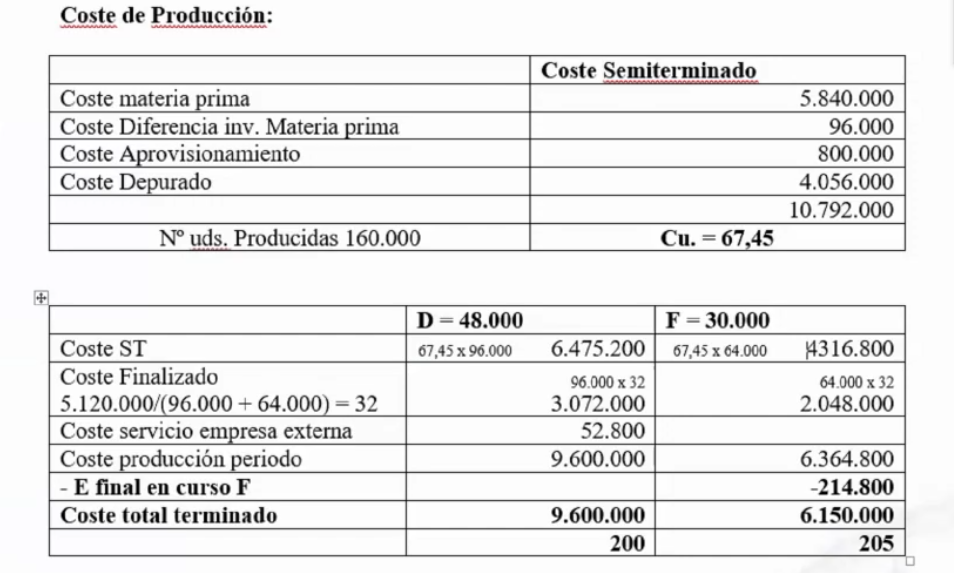

# Ejercicios tema 4

## `Ejercicio 22 - Subreparto entre secciones relacionadas`

La estadística de costes del reparto primario de una empresa es la siguiente:

El subreparto de lost alleres se realiza de la siguiente forma:

- El `taller auxiliar` trabajó 2.050 horas (200 `taller 1`, 50 `taller auxiliar`, 200 `taller 2`, 100 `taller 3` y 1.500 `mantenimiento`)
- `Mantenimiento` trabajó 3.000 horas (500 `taller auxiliar`, 1.200 `taller 2` y 1.300 `taller 3`)

**Se pide realizar el reparto secundario.**

## `Ejercicio 23 - Subreparto`

A partir de una única materia prima la empresa DUFE S.A., elabora dos productos D y F. La materia prima es tratada en una primera sección de `DEPURADO`, para obtener un Semiterminado y un desecho, que es eliminado sin ningún tipo de coste. En una segunda sección de `FINALIZADO` a partir del Semiterminado se obtienen los productos finales D y F. Datos relativos a inventarios (Valoración: criterio `FIFO`):

||Existencias iniciales|Existencias finales|
|--|--|--|
|Materia prima|20.000 Kg a 60 um/Kg|?|
|D|10.400 uds a 220 um/ud|?|
|F|14.000 uds a 240 um/ud|?|
|F en curso sección finalizado (1)|0|2.000 uds con coste total de 214.800|

En el almacén de materias primas se prevé una pérdida del 1,5 % de la cantidad comprada. Se gestionan en el centro aprovisionamiento. Al final del período, al realizar el inventario físico, se observa que las existencias finales reales de los productos terminados son un 2 % inferior a las contables.

- En Depurado se obtienen 160.000 uds. de Semiterminado, consumiéndose íntegramente en la sección de Finalizado, destinándose el 60% a la obtención de D y el 40% a F.
- En Finalizado se obtienen 30.000 de F y 48.000 uds. de D, al necesitar 2 uds. de Semiterminado por ud. de terminado, quedando en curso de elaboración 2.000 uds de F valoradas en 214.800 u.m (1).

Datos relativos a costes: Las compras de materia primas fueron 80.000 uds. a 80 u.m./ud., consumiéndose 78.000 uds.

- La sección auxiliar de Mantenimiento trabajó 800 h-h que se distribuyeron para Supervisión (240 h-h), Depurado (360 h-h), Finalizado (160 h-h) y Comercial (40 h-h).
- La sección auxiliar de Supervisión realizó un total de 4.000 controles: 480 para ella misma, 320 para Mantenimiento y 1.600 para cada sección de transformación.
- Los costes de Finalizado se imputan según el Semiterminado consumido por cada producto. Además para terminar el producto D, se necesita de un proceso especial que es contratado con una empresa externa, y cuyos servicios suponen un coste adicional de producción de 52.800 u.m.

Los costes comerciales se reparten a los productos según las unidades vendidas. Los ingresos por ventas de D ascendieron a 15.000.000 u.m. (50.000 uds.) y los de F a 10.000.000 u.m. (40.000 uds.).

**Se pide:**

1. **Diagrama del proceso.**
2. **Inventarios Permanentes.**
3. **Estadística de costes.**
4. **Coste unitario de todos los productos.**
5. **Cuadro de márgenes y resultados.**

## `Ejercicio 24 - Valoración de productos en curso (producción equivalente)`

La empresa ÑIU S.A. valora sus productos en curso de su producto EQ1 mediante el método de la producción equivalente. En el período de producción presenta unas existencias iniciales de 200 uds. valoradas en 3.600€. Estas unidades incorporaban el 80% de materia prima, el 60% de mano de obra directa y, el 50% de costes indirectos.

Durante el período se han iniciado 5.500 uds. Las unidades terminadas de EQ1 han sido de 5.200.
Las existencias finales de productos no terminados incorporaban el 90% de materia prima, el 80% de mano de obra directa y, el 60% de costes indirectos.

Los costes en los que se ha incurrido en el período son de 40.000€ de materia prima, 35.000 de mano de obra directa y, el 20.000 de costes indirectos.

**Se pide la valoración del inventario de productos en curso de ÑIU S.A.**

