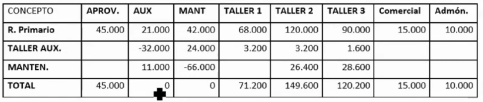

# Ejercicios tema 4

## `Ejercicio 22 - Subreparto entre secciones relacionadas`

La estadística de costes del reparto primario de una empresa es la siguiente:

El subreparto de lost alleres se realiza de la siguiente forma:

- El `taller auxiliar` trabajó 2.050 horas (200 `taller 1`, 50 `taller auxiliar`, 200 `taller 2`, 100 `taller 3` y 1.500 `mantenimiento`)
- `Mantenimiento` trabajó 3.000 horas (500 `taller auxiliar`, 1.200 `taller 2` y 1.300 `taller 3`)

**Se pide realizar el reparto secundario.**

## `Ejercicio 24 - Valoración de productos en curso (producción equivalente)`

La empresa ÑIU S.A. valora sus productos en curso de su producto EQ1 mediante el método de la producción equivalente. En el período de producción presenta unas existencias iniciales de 200 uds. valoradas en 3.600€. Estas unidades incorporaban el 80% de materia prima, el 60% de mano de obra directa y, el 50% de costes indirectos.

Durante el período se han iniciado 5.500 uds. Las unidades terminadas de EQ1 han sido de 5.200.
Las existencias finales de productos no terminados incorporaban el 90% de materia prima, el 80% de mano de obra directa y, el 60% de costes indirectos.

Los costes en los que se ha incurrido en el período son de 40.000€ de materia prima, 35.000 de mano de obra directa y, el 20.000 de costes indirectos.

**Se pide la valoración del inventario de productos en curso de ÑIU S.A.**

