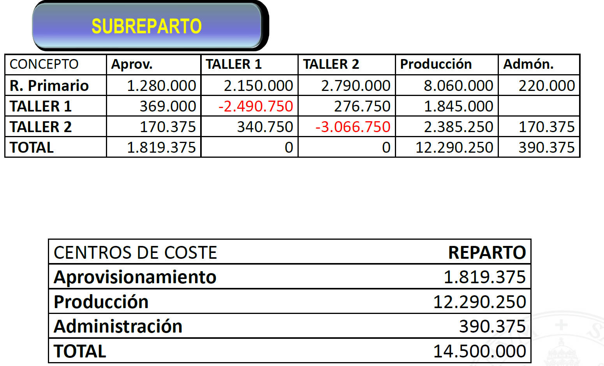

# El sistema de contabilidad por secciones

Podemos dividir el análisis de costes en las siguientes cuatro etapas o fases:

1. Identificación de la actividad de la empresa y sus características
2. Identificar el coste de lso diferentes factores en cada centro
3. Imputación del coste de los factores al producto
4. Cálculo de márgenes

## Los centros

`Centro de compras (aprovisionamiento)`
:   En él se realizan las ^^tareas de recibir, almacenar y suministrar todas las materias primas o existencias comerciales^^.
    Ejemplo de costes: personal de almacén, compras, alquileres, electricidad, amortizaciones, vigilancia.

`Centro de producción / fabricación / transformación`
:   En él se realizan ^^tareas típicas del proceso productivo^^.
    Ejemplo de costes: gastos de personal y amortizaciones.

`Centro de venta`
:   En él se realiza la actividad típica de ^^comercialización de productos terminados^^.
    Ejemplo de costes: tareas de marketing, publicidad

`Centro de administración`
:   En él se realizan a cabo ^^tareas de contabilidad y facturación^^.

### Problemas

- Si hay interrelaciones entre distintas secciones **se establecerá un criterio de reparto previo**.
- El autoconsumo no se repercute, se puede eliminar.

### Ejercicio de subreparto entre secciones relacionadas

- `Taller 1` trabajó 160h (20 aprovisionamiento, 25 `Taller 1`, 15 `Taller 2` y 100 producción)
- `Taller 2` trabajó 90h (5 aprovisionamiento, 10 `Taller 1`, 70 producción y 5 administración)

|Centro de costes|Reparto primario|
|--|--|
|Aprovisionamiento|1.280.000|
|Taller 1|2.150.000|
|Taller 2|2.790.000|
|Producción|8.060.000|
|Administración|220.000|
|Total|14.500.000|

## Valoración de la producción en curso

Existen varios métodos, cada uno se podrá aplicar de forma más eficaz dependiendo de la tipología del proceso productivo (anque el más utilizado es el de la **producción equivalente**).

### Métodos de valoración de la producción en curso

`Métodos simples`
:   Se basan en la apreciaciíon subjetiva del grado de desarrollo y estimando el consumo de factores. {>>Ej: parece que el bote de gel está al 80%<<}

`Métodos establecidos para la producción continua`
:   Valora la producción en curso teninedo en cuenta el tiempo transcurrido desde el inicio del proceso, la cantidad consumida de un factor, el consumo de materiales... Sólo se puede aplicar si tenemos producción continua.

`Basados en producción equivalente`
:   Establece un grado de avance tomando como referencia una equivalencia respecto del producto ya acabado. Se establece una equivalencia para cada coste que comprende el coste de producción. 
    **Se basa en un porcentaje de unidades equivalentes terminadas. Este porcentaje se basa en el grado de terminación.**

!!! note
    La producción terminada será el resultado de terminar las ^^unidades equivalentes del proceso anterior^^ más las ^^unidades empezadas y terminadas en el proceso^^ restando las ^^unidades equivalentes que queden al final de dicho proceso^^.

### Ejemplo producción equivalente

Hay un excel en el [campus virtual](https://campusvirtual.uva.es/mod/resource/view.php?id=1051912) que no entiendo.

<!-- |Unidades|%||Existencias finales|
|:--:|:--:|:--:|--|
|4|0,25|1,00||
|38|1,00|38,0|||
|6|0,75|4,50|4|.5\*1.149,43=5.172,44|
|Suma||43,50|

Coste unitario: 50.000 / 43,5 = 1.149,43 -->

## Cómo afrontar las mermas

Son unidades de inventario que desaparecen o aparecen estropeadas.

!!! success "Resolución del ICAC"
    Se distingue entre producción dañada normal y atípica. **La normal será coste de producción** (como un coste indirecto) y **la atípica será gasto del ejercicio**.

!!! question "Normal vs atípica"
    - Normal: previsto, tolerable
    - Atípico: imprevisto, no tolerable

!!! danger "Mermas en productos terminados"
    **Si las mermas se han producido en los productos terminados no se puede clasificar como coste de producción.**{.red}
    Mermas de productos terminados se considera una pérdida del ejercicio.

!!! info "Indemnizaciones"
    Son ingresos del ejercicio, no reducen el coste de producción.
