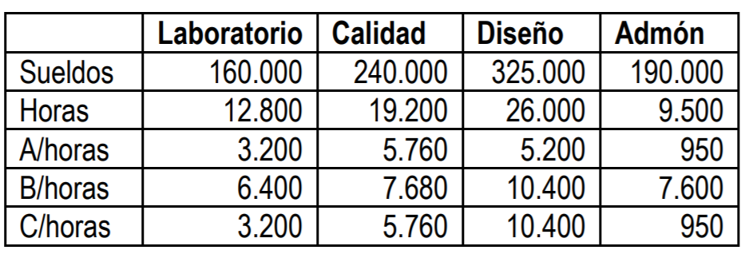
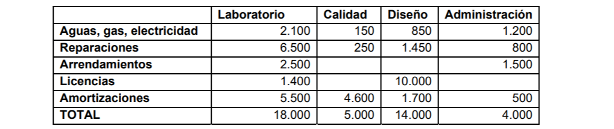

# Ejercicios tema 5

## Ejercicio 26 - costes por pedido o proyecto

Norma 11ª aptdo. 1 de la Resolución ICAC 14‐4‐20151

La empresa “PROPED S.A.” se dedica a la elaboración e impresión en tres dimensiones de proyectos aeroespaciales.

Cada pedido que recibe tiene unas características específicas, lo que hace que no tengan la característica de intercambiables. Debido a ello “PROPED S.A.” desarrolla su contabilidad de gestión conforme a la norma 11ª de la RICAC 14/4/2015, sobre la determinación del coste de producción.

- En el ejercicio de 20XX, desarrolla tres proyectos. El proyecto “A”, que al cierre del ejercicio anterior se encontraba en un grado de avance del 40%.
- El proyecto “B” que ha comenzado y terminado en este ejercicio. Y, el “C”, que también ha comenzado y terminado en ejercicio actual. Las materias primas que utiliza son fotopolímeros y termoplásticos.
- Las secciones en las que organiza la actividad son Laboratorio, Calidad, Diseño y Administración. La comercialización de los proyectos se lleva a cabo por una agente que ha facturado en 20XX una cantidad de 26.000€
- { align=right width=50% } La actividad realizada en cada proyecto, medida en horas de trabajo, así como los sueldos (incluida la seguridad social), se detallan en la tabla adjunta. La sociedad considera criterio racional de reparto de costes las horas de mano de obra utilizadas en cada proyecto, y no el consumo de materias primas.
- Los demás costes directos que constituyen el coste de producción son el consumo de materias primas, los trabajos realizados por otras empresas, que representan un 20% de este consumo, y las dietas. Estas últimas han sido para el proyecto “A”, “B” y “C” de 1.500, 3.000 y 1.200€ respectivamente. En administración las dietas ascendieron a 2.000€

Consumos de materiales:

Los inventarios son:

En cuanto al resto de costes, por secciones, se han producido los siguientes:

Los tres proyectos obtienen unos ingresos provenientes de los presupuestos dados al
cliente. Estos presupuestos carecen de cláusula de revisión de precios, por lo que dicho precio se
considera cerrado.

Los presupuestos firmados con los clientes han sido:

**Se pide:**

- **Determinar la rentabilidad de cada proyecto.**
- **Determinar el resultado de la actividad de 20XX.**
