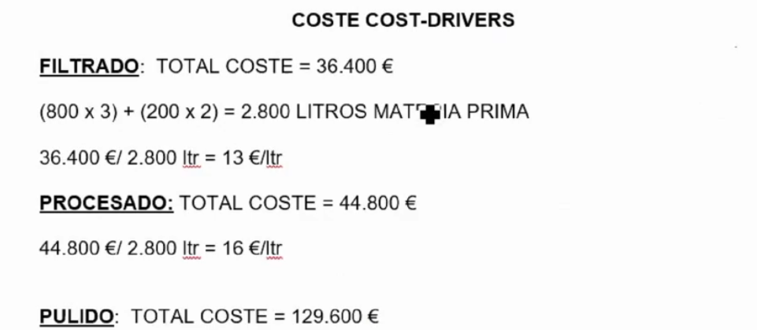
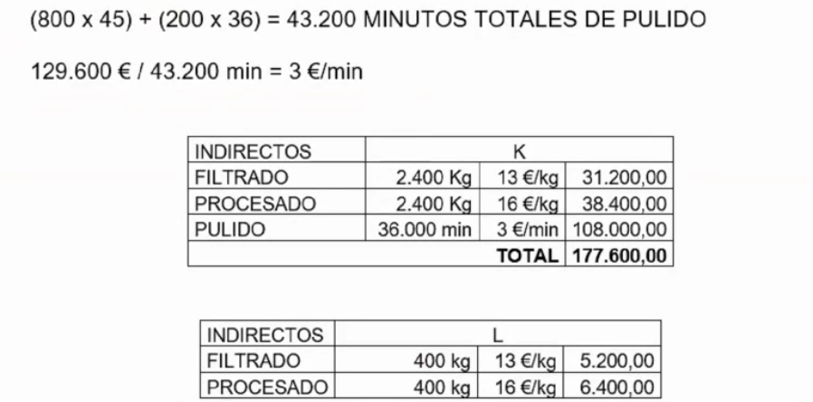
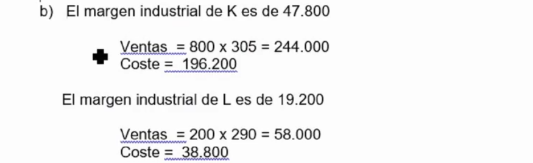

# Ejercicios tema 6

## `Ejercicio 27 - método abc`

La sociedad *Altas Bodegas de Castilla* calcula el coste de sus productos aplicando un modelo de costes por actividades (ABC). Fabrica dos productos; el producto K y el producto L. Las actividades se realizan en un único centro; FABRICA, estas son filtrado, procesado y pulido.

Del primero se han fabricado 800 unidades y del segundo 200. Todas las unidades son vendidas.

Respecto de los costes directos se sabe que:

- K consume 3 litros de materia prima “M” por unidad. El coste por litro de “M” es de 1,5 €/lt.
- L consume 2 litros de materia prima “M” por unidad.
- La mano de obra directa de una unidad de K exige un total de 1,5 horas
- La mano de obra directa de una unidad de L exige un total de 2 horas.
- El coste por hora de mano de obra directa ha ascendido a 12,5 €/h

Respecto de los costes indirectos se sabe que:

- La actividad de filtrado tiene como cost-driver los litros de materia prima filtrados, el coste de la actividad ha sido de 36.400€.
- La actividad de procesado tiene también como cost-driver los litros de materia prima procesada, su coste ha sido de 44.800€.
- La actividad de pulido tiene como cost-driver los minutos. Cada unidad de K se pule en 45 minutos, y la de L en 36. A esta actividad se la ha atribuido un coste de 129.600€.

**Se Pide:**

1. **Determinación del coste unitario de cada producto según el modelo de costes ABC.**
2. **Siendo el precio de venta de K es de 305€ y el de L de 290€, si la empresa se viera obligada a reducir la producción ¿por qué?**

Carecería de toda lógica de gestión económica dejar de fabricar el producto K, del que se venden cuatro veces más unidades (el enunciado informa de la venta de **TODAS LAS UNIDADES**) y del que se obtiene un margen industrial un 148% superior al del producto L.

Si la empresa tuviera que dejar de fabricar obligatoriamente un producto este sería L.
