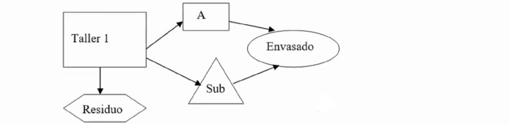
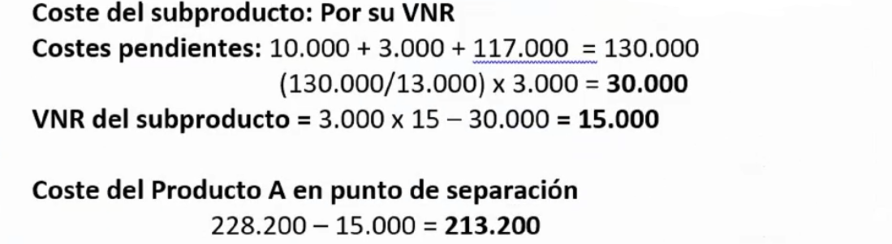

# Ejercicios tema 7

## `Ejercicio 29 - producción cojunta`

Norma 5ª de la Resolución ICAC 14-4-2015

La empresa "PROTA S.A:", fabrica el producto A en los centros taller 1 y envasado y embalaje, en su proceso de fabricación se obtiene de forma inexorable el subproducto B, en el taller 1, el cual tiene esa calificación por tener un valor bajo en el mercado, considerado de importancia secundaria.

El proceso fabril genera también unos residuos, que lejos de tener un valor de mercado, deben ser objeto de eliminación obligatoria dada su toxicidad, lo que ha supuesto un coste para la empresa de 8.200 €.

Las compras del ejercicio han sido de 18.000 Kg a un precio de 10€/kg.

El coste de mano de obra directa ha sido de 11.000€, 8.000 en el taller 1 y el resto en la sección de envasado.

En los inventarios finales del ejercicio anterior y en los de este no han existido existencias de ningún tipo.

La sección de envasado y embalaje ha tenido unos costes totales indirectos de 117.000€. Mientras que los costes indirectos del taller 1 han ascendido a 32.000€. Los envases, han ascendido a 10.000€. Los costes de la sección de envasado y embalaje se reparten de forma proporcional a los kilos envasados.

Se han obtenido durante el proceso de fabricación 10.000 Kgs. del producto A y 3.000 Kgs. del subproducto B; éste último es vendido a 15 €.

**Se pide:**

1. **Diagrama de costes**
2. **Fichas de inventario**
3. **Coste unitario de los productos, subproductos y residuos**

