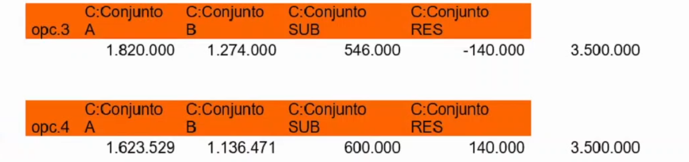
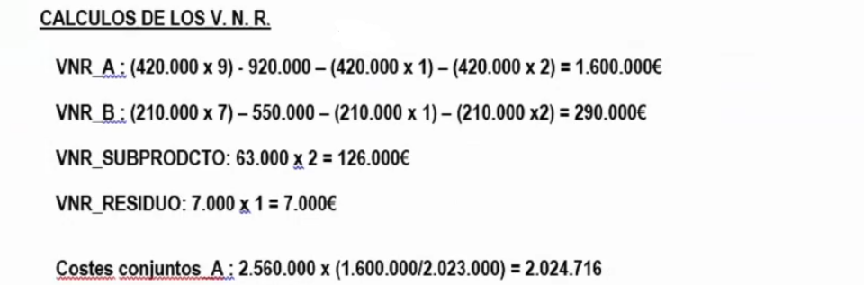

# Ejercicios tema 7

## `Ejercicio 29 - producción cojunta`

Norma 5ª de la Resolución ICAC 14-4-2015

La empresa "PROTA S.A:", fabrica el producto A en los centros taller 1 y envasado y embalaje, en su proceso de fabricación se obtiene de forma inexorable el subproducto B, en el taller 1, el cual tiene esa calificación por tener un valor bajo en el mercado, considerado de importancia secundaria.

El proceso fabril genera también unos residuos, que lejos de tener un valor de mercado, deben ser objeto de eliminación obligatoria dada su toxicidad, lo que ha supuesto un coste para la empresa de 8.200 €.

Las compras del ejercicio han sido de 18.000 Kg a un precio de 10€/kg.

El coste de mano de obra directa ha sido de 11.000€, 8.000 en el taller 1 y el resto en la sección de envasado.

En los inventarios finales del ejercicio anterior y en los de este no han existido existencias de ningún tipo.

La sección de envasado y embalaje ha tenido unos costes totales indirectos de 117.000€. Mientras que los costes indirectos del taller 1 han ascendido a 32.000€. Los envases, han ascendido a 10.000€. Los costes de la sección de envasado y embalaje se reparten de forma proporcional a los kilos envasados.

Se han obtenido durante el proceso de fabricación 10.000 Kgs. del producto A y 3.000 Kgs. del subproducto B; éste último es vendido a 15 €.

**Se pide:**

1. **Diagrama de costes**
2. **Fichas de inventario**
3. **Coste unitario de los productos, subproductos y residuos**

## `Ejercicio 30 - producción conjunta`

Norma 5ª de la Resolución ICAC 14‐4‐2015

La compañía T1, con cuatro centros de trabajo que actúan por este orden, en cadena, Tamizado, Horneado, Secado y Empaquetado presenta el siguiente estado de costes totales en euros para cada uno de ellos, en los que se han incorporado los costes directos e indirectos:

Tamizado: 2.150.000; Horneado: 1.350.000; Secado: 3.250.000; Empaquetado: 999.800

Al finalizar las actividades del segundo centro, Horneado, se producen de forma inexorable dos coproductos, A y B, un subproducto y, un residuo. Cada uno, respectivamente, con los Valores Netos Realizables de 2.000.000, 1.400.000, 600.000, y 140.000 euros.

**La sociedad desea saber la imputación de costes, en el punto de separación, a cada componente generado en su proceso productivo, si:**

1. No se considerase ningún componente de importancia secundaria.
2. Se considerara el residuo de importancia secundaria.
3. No se considerase ningún componente de importancia secundaria, pero el residuo tuviese un coste se retirada de 140.000€.
4. Se considerara de importancia secundaria al subproducto y al residuo.

**La sociedad opta por valorar por su Valor Neto Realizable todo componente de importancia secundaria.**

Para más info:

- `2021-04-27`
- `2021-04-28`

## `Ejercicio 31 - producción conjunta`

_Norma 5ª de la Resolución ICAC 14‐4‐2015._

La empresa "Quimiflux S.A.U." utiliza en su proceso productivo un compuesto químico denominado Ce200 como única materia prima.

En una fase inicial denominada Destilado se obtiene un Producto A y un Producto B. Además, la sección de destilado proporciona un subproducto y un residuo R.

Los productos A y B continúan el proceso productivo. A, se procesa en la sección Ionizado y el B en la de Conglomerado. En la sección de IONIZADO se añaden materias auxiliares.

Los productos A y B, finalmente se envasan en la sección de envasado.

Por cada unidad, equivalente a un litro, de Ce200 se obtienen 600 centímetros cúbicos de A, 300 de B, 10 de residuo y el resto de subproducto.

Los costes de personal directamente imputados al producto han sido, por secciones:

El proceso productivo carece de mermas. Tampoco se ha detectado diferencias de inventario. El precio de la materia prima ha sido de 2,5€/udad.

Los inventarios son:

El coste de los envases ha sido de 2€. Cada litro de Producto A, o B, se envasan en un recipiente único de igual capacidad, mientras que el subproducto y el residuo son retirados, sin ser envasados, por un cliente.

Las adquisiciones de materias auxiliares han sido de 90.000 uds. Su precio no ha variado respecto del ejercicio anterior.

El precio de venta del Producto A es de 9€ y el del producto B de 7€. En cuanto al subproducto de 2€ y el residuo de 1€.

En cuanto al resto de costes, por secciones, se han producido los siguientes:

La sección de envasado reparte sus costes en función de las unidades envasadas.

La actividad comercial de la empresa se ha externalizado, por ello se ha facturado un total de 58.000€.

El coste de los residuos no ha variado desde el ejercicio anterior. Lo mismo ha ocurrido con los subproductos.

**Se pide:**

- **Diagrama del proceso.**
- **Inventarios.**
- **Determinar el resultado de la actividad de 20XX.**
- **Determinar el impacto sobre el resto de productos y subproductos si el residuo hubiese tenido un coste de retirada de 120.000€.**
- **Determinar el impacto sobre el resto de productos y subproductos si el residuo hubiese tenido un coste considerado de importancia secundaria.**

Para más info:

- `2021-04-29`
- `2021-04-30` (excel, no incluido)
- `2021-05-03` (excel, no incluido)

## `Ejercicio 32 - producción conjunta`

_Norma 5ª de la Resolución ICAC 14‐4‐2015._

La empresa "Resinas Belgas S.A." utiliza en su proceso productivo una resina especial como única materia prima. En la fase inicial de `DESTILACIÓN` se añaden las materias primas y los aditivos. Tras el destilado se obtiene como subproducto, "pez", residuos, "sarros", y los productos "trementina" y "colofonia". Los productos continúan el productivo hasta la sección de `DEPURADO`.

En el centro de `DEPURADO`, se filtran los productos, "trementina" y "colofonia", y los costes se reparten en función de los litros filtrados de cada uno de ellos.

El subproducto tiene una importancia secundaria, por lo que en aplicación de la Resolución del ICAC relativa al coste de producción, la empresa lo valora por su valor neto realizable. Los sarros tienen un coste de retirada de 100.000€

La sección de ENVASADO, finaliza el proceso de producción. En este centro se envasan los productos en dos formatos: la "trementina" en botellas de litro y "colofonia" en barriles de 20 litros. Los costes del centro de envasado se reparten utilizando como unidad de obra los litros procesados de los productos.

En el inventario de "trementina", ya envasada, ha existido una diferencia de inventario no prevista del 10% del coste de ventas. El proceso productivo carece de mermas. El precio de la resina ha sido de 4,25€/litro.

Por cada litro de resina se obtienen, se obtienen 400 cc de "trementina", 300 de "colofonia", 100 de residuo y el resto de subproducto. Los aditivos, se añaden en el proceso en una proporción del 100 cc por cada litro resina consumida. La mano de obra directa ha sido:

En cuanto al resto de costes, por secciones, se han producido los siguientes:

El coste de los envases barriles ha sido de 8 €. El precio de venta trementina es de 15 €/ltr, el de colofonia de 20 €/ltr, el de pez de 5€/ltr. No existe producción pendiente de terminar.

Los inventarios facilitados por la empresa son:

El coste de los residuos no ha variado desde el ejercicio anterior. Lo mismo ha ocurrido con los subproductos. Todos los inventarios se valoran por el FIFO.

**Se pide el coste de venta unitario de los coproductos.**

Para más info:

- `2021-05-04`
- `2021-05-05`
- `2021-05-06`
