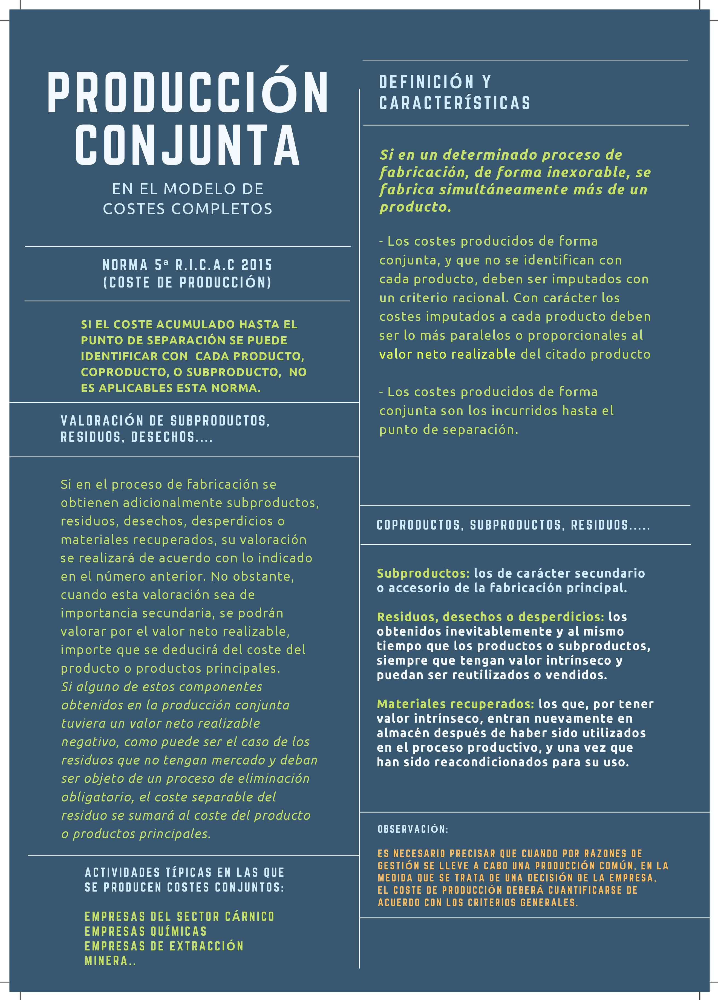

# La producción conjunta

!!! quote "Producción conjunta"
    "Cuando la obtención simultánea de productos viene impuesta por las características técnicas del proceso de producción, no por su planificicación."

Si la empresa decide fabricar bienes empleando un proceso productivo global para conseguir economías de escala de forma que fuese posible dejar de fabricarse alguno o algunos de los productos nos encontraríamos ante procesos de producción **en común**.

## Características

- No es posible eliminar la obtención de multiplicidad de *outputs* productivos
- Pueden generarse coproductos: productos conjuntos
- Posibilidad de obtenerse productos principales y subproductos (de menor de mercado)

## Conceptos

- **Punto de separación:** momento del proceso de producción conjunta a partir del cual es posible identificar y proporcionar un trato diferenciado a cada uno de los productos que se obtienen en dicho proceso
- Costes conjuntos: los costes del proceso de producción conjunta aplicados antes del punto de separación
- Costes específicos (separables): costes directos y/o indirectos que se aplican a los productos después del punto de separación

## Coproductos, subproductos y residuos

La distinción entre coproductos, subproductos y residuos viene dada por su valor de venta respectivo. Por eso la diferencia entre suproductos y residuos es muy pequeña y su tratamiento contable es similar.

En caso de los desechos, estamos ante productos que es preciso eliminar, incluso en ocasiones teniendo que incurrir en costes adicionales (como en el caso de aquellos que precisan un tratamiento para eliminar su toxicidad). Los costes de eliminación han de ser imputados a los costes principales.

## Qué podemos encontrar entre los métodos para su valoración y cálculo de costes

!!! danger
    Estos son métodos que se han usado en el pasado, pero ya no se usan

- Asignar como valor de coste del subproducto o residuo el correspondiente a su precio de venta. Disminuye el coste de la producción.
- El importe de venta de los subproductos y residuos se considera sin coste.
- Estimar un valor del coste del subproducto proporcional a su valor de mercado.
- Cuando el subproducto o residuo se incorpora al ciclo productivo o se usa para otros fines, se determina un precio de cesión como un aprovisionamiento más, calculado en base al coste de reposición o valor del mercado.

## Los materiales recuperados

Simplemente se valorarán por el contenido quee posean del material o materia prima correspondiente.

Tiene que ver con el valor neto realizable.
