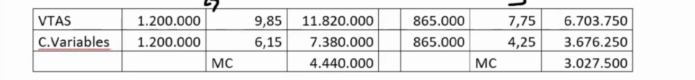
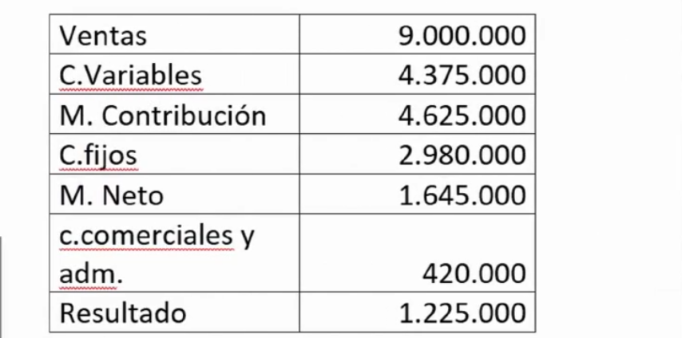
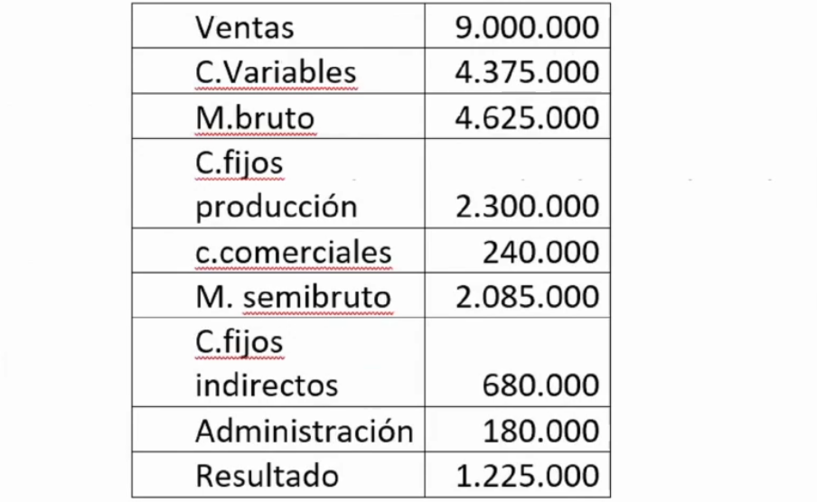

# Ejercicios tema 8

## `Ejercicio 33 - direct costing`

La empresa "ALFASA" fabrica dos productos el "G" y el "J".

Las unidades vendidas del primero han sido en el período de 1.200.000, a un precio de 9,85€. Las unidades vendidas de "J" han sido en idéntico período de 865.000 uds., a un precio de 7,75.

Los costes variables unitarios de "G" son de 6,15€ y los de "J" de 4.25€.

**Se pide la determinación de los márgenes de contribución mediante el método Direct-Costing.**

## `Ejercicio 34 - direct costing`

La Empresa "β S.A." presenta la siguiente información relativa a de costes de producción, que se han producido en dos centros de fabricación, en donde elabora un único producto, el "K_28", y a las ventas del ejercicio.

Las materias primas compradas y consumidas en período han ascendido a 1.125.000€. La mano de obra directa ha sido de 3.250.000€.

Las ventas del período han sido de 9.000.000€.

Las amortizaciones de maquinaria e instalaciones, han seguido un método lineal, lo que ha supuesto en el período un total de dotaciones de 2.300.000€.

Los gastos de administración del período han sido de 180.000€, mientras que los relativos a la actividad comercial han alcanzado los 240.000€.

En cuanto a los suministros y otros servicios, la empresa tiene contratadas tarifas planas, lo que supone una cuota constante de 680.000€.

**Se pide la determinación de los márgenes mediante los métodos de Direct-Costing y Direct-Costing desarrollado.**

