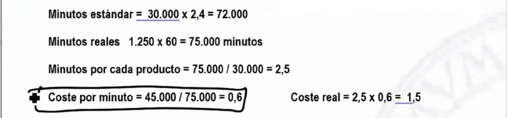
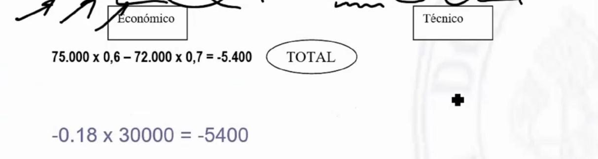
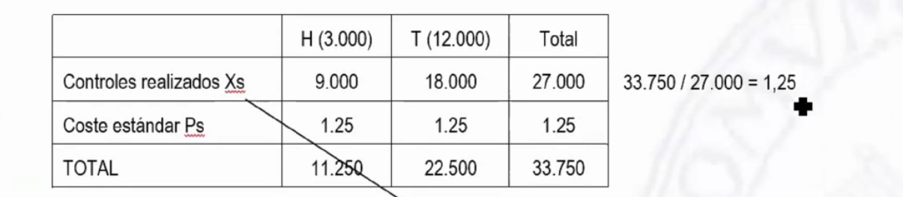

# Ejercicios tema 9

## `Ejercicio 35 - costes estándar`

Una empresa tiene un centro de producción. Según los costes estándar, para una producción de 25.000 uds, deberá emplear 1.000 horas. El coste presupuestado es de 42.000€.

En el ejercicio, ante un aumento de la demanda ha tenido que fabricar 30.000 uds. Se han empleado para ello 1.250 horas y el coste del centro ha sido de 45.000€

**¿Presenta desviaciones esta empresa?**

## `Ejercicio 36 - costes estándar`

La empresa "PINK $ RED S.A." se dedica a la fabricación de patinetes eléctricos, con dos acabados diferentes el Hellwheel (H) y el Trend (T). La empresa aplica un modelo de costes estándar.

En la sección de pintura se ejecutan dos actividades en función del acabado. Para el producto con acabado (H) se realizan 3 controles de calidad de la pintura, mientras que para el (T) es de 1,5€.

El coste de la sección para 15.000 unidades está presupuestado en 33.750€. Fabricando, normalmente, un 20% con el acabado (H) y el resto con el acabado (T).

En el ejercicio actual se ha fabricado 18.000 patinetes. Se han realizado 35.000 controles y el coste del centro ha sido de 44.100€.

**Analice las desviaciones.**

