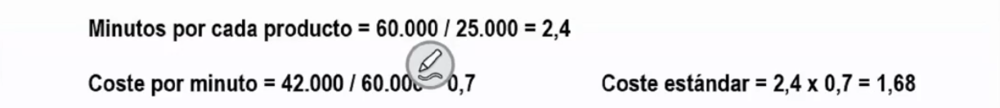

# Ejercicios tema 9

## `Ejercicio 35 - costes estándar`

Una empresa tiene un centro de producción. Según los costes estándar, para una producción de 25.000 uds, deberá emplear 1.000 horas. El coste presupuestado es de 42.000€.

En el ejercicio, ante un aumento de la demanda ha tenido que fabricar 30.000 uds. Se han empleado para ello 1.250 horas y el coste del centro ha sido de 45.000€

**¿Presenta desviaciones esta empresa?**

## `Ejercicio 36 - costes estándar`

La empresa "PINK $ RED S.A." se dedica a la fabricación de patinetes eléctricos, con dos acabados diferentes el Hellwheel (H) y el Trend (T). La empresa aplica un modelo de costes estándar.

En la sección de pintura se ejecutan dos actividades en función del acabado. Para el producto con acabado (H) se realizan 3 controles de calidad de la pintura, mientras que para el (T) es de 1,5€.

El coste de la sección para 15.000 unidades está presupuestado en 33.750€. Fabricando, normalmente, un 20% con el acabado (H) y el resto con el acabado (T).

En el ejercicio actual se ha fabricado 18.000 patinetes. Se han realizado 35.000 controles y el coste del centro ha sido de 44.100€.

**Analice las desviaciones.**

## `Ejercicio 37 - cóstes estándar`

La empresa "PIM-PAM" se dedica a la fabricación de rifles de precisión, fabrica dos modelos diferentes el Short y el Long. La empresa aplica un modelo de costes estándar.

En la sección de engatillado el modelo Short debe ser sometido a 3 ajustes. El otro modelo a 5.

En el ejercicio actual se han fabricado 17.500 unidades que han sido sometidas a 64.100 ajustes. El coste del centro de engatillado ha sido de 99.355€

El coste del centro para 16.000 unidades está presupuestado en 83.520€. De la fabricación se destina un 70% al modelo Short y el resto al Long.

**Comente y analice las desviaciones de la empresa.**

## `Ejercicio 38 - costes estándar`

La empresa "BAGING S.A." se dedica al envasado de un único producto "As14" para un tercero. Para ello utiliza una sección, PACK. El producto se envasa en dos formatos, uno, un bidón de 10 litros y otro, una botella de 800 centímetros cúbicos.

Del total envasado, un 30% se destina al embotellado, botella de 800 cc, el resto se envasa en los bidones. Está previsto que se envasen 16.000.000 de litros de "As14", con un precio de compra que será de 4,8€/litro. El tiempo de envasado es de 24 segundos para la botella y de 48 segundos para el bidón. El coste de la sección PACK se presupuesta en 5.768.000€. Precio estimado de los envases 2.5€ para la botella y de 7€ para el bidón.

Los datos reales revelan que se han adquirido 19.200.000 litros de "As14". Se han trabajado 67.000 horas, 48.000 en botellas 19.000 en bidones; y el coste ha sido de 6.633.000€. Los inventarios han sido los siguientes:

**Se pide el cálculo de cotes estándar y desviaciones.**

## `Ejercicio 39 - costes estándar`

La empresa industrial CASOSA transforma la materia prima P en la Fase 1, de donde sale convertida en el producto terminado S.

`Datos estándares`

Esta empresa realiza un estudio técnico de las condiciones esperadas para su proceso y establece los siguientes estándares (para una producción de 20.000 uds. de S):

- La materia prima tiene un coste de adquisición de 70 u.m./kg. y un suplemento por coste específico de Aprovisionamiento de 6 u.m./kg.
- Cada unidad de producto terminado S debe incorporar 1 kg. de materia prima.
- La tasa horaria por unidad de producto y el coste horario son los siguientes:
    - MOD: 0,04 h-h/ud. a 600 u.m./h-h
    - Fase 1: 0,025 h-m/ud. a 1.000 u.m./h-m
- Los costes comerciales y de administración presupuestados son: 200.000 u.m. y 115.000 u.m., respectivamente.

`Datos reales`

- No hay ningún tipo de existencia inicial.
- Compra 20.000 kgs. de materia prima a 72 u.m./kg. y consume 18.000 kgs.
- La MOD trabajada 750 h-h y su coste total es de 461.250 u.m.
- Las instalaciones de la Fase 1 funcionan durante 490 h-m.
- La producción es de 19.000 uds. y las ventas son 15.000 uds. a 200 u.m./ud.

**Se pide:**

1. **Coste estándar unitario de producción de S.**
2. **Inventarios permanentes.**
3. **Cálculo de las desviaciones.**
4. **Cuadro de márgenes y resultados.**

**Lo ha resuelto en sucio, no ha llegado a mostrarlo en limpio.**
{.magenta}
