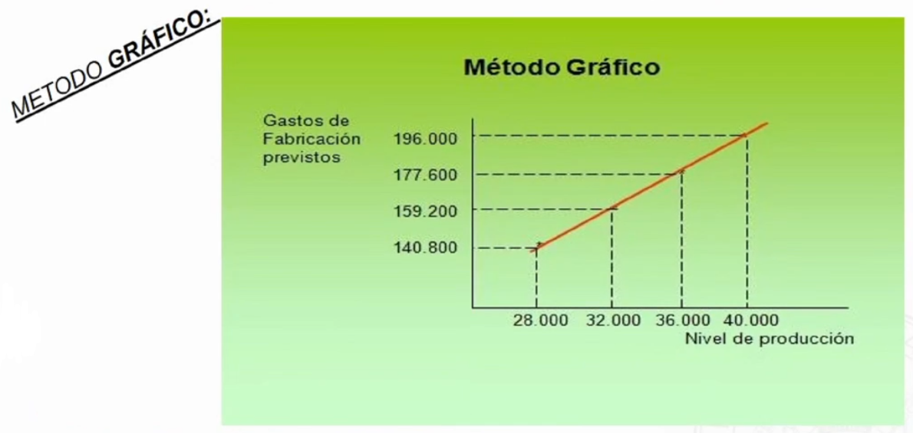

# Método de costes estándar

El método de los costes estándar constituye un sistema **provisional**. Hay quien afirma que supone la máxima expresión de los sistemas de contabilidad analítica o de costes, llegando a considerarse el método **más eficaz y de mayor validez** para la correcta gestión de la empresa.

Su objetivo es el registro y comparación sistemática de los costes incurridos con sus previsiones.

## Cálculo de los costes estándar

No sigue una secuencia lógica, sinoq ue parte de los inputs iniciales y se divide en:

- Outputs o salidas del proceso: valorando los rendimientos de los centros de coste en función de los estándares precalculados, y valorando los productos.
- Inputs o entradas del proceso: introducción de costes reales de los factores hasta alzancar su imputación a los centros.
- Cálculo y análisis de las desviaciones.
- Cuantificar los márgenes y resultados en función de los precios de venta.

### Fórmulas de cálculo de los costes estándar

Para el cálculo se pueden utilizar:

- Costes del periodo precendente
- Costes anteriores debidamente actualizados
- Tarifas existentes en el sector
- Análisis técnico-económico
- Presupuesto de explotación.

## Costes estándar en función de la actividad

- Ideal: se supone un rendimiento del 100%
- Óptimo: se obtiene partiendo del estándar ideal y restando las interrupciones necesarias. Es un objetivo alcanzable.
- Real o normal: son los aplicables de forma real por la empresa. Es una medida adaptada a las condiciones particulares de la empresa. Debe tener en cuenta factores como la demanda del mercado. A partir de este dato se establecen los estándares concretos sobre los que se realizarán las previsiones.

## El escandallo

Consiste en el cálculo anticipado del coste probable de una producción. Pone de manifiesto las cantidades necesarias y los precios de coste unitario de los diferentes factores o elementos que intervienen e nla fabricación.

Hay dos clases de componentes:

- Técnica: unidades físicas de consumo
- Económica: valor asignado al os consumos

## El presupuesto flexible

Se materializa en la confección de una tabla de costes por departamentos para los distintos niveles de actividad.

!!! question "Determinación"
    1. Determinar el período de tiempo que va a servir como base de cálculo. (diario, semana, quincenal, mensual...).
    2. Fijar los nivles **máximo** y **mínimo** de producción.
    3. Estudio del comportamiento de cada elemento de coste en función del nivel de actividad (costes fijos, variables, semifijos o semivariables).

### Métodos de cálculo

- Tabluación directa: establece el montante global de cada partida de coste por naturaleza previsto para los diferentes niveles de producción en función de la unidad de obra más adecuada.
- Método de la fórmula persupuestaria: se basa en la diferenciación de las componentes fija y variable de cada partida de coste.
- Método gráfico: es complementario a los anteriores. Permite relacionar los gastos de fabricación con los diferentes niveles de producción previstos, mediante su representación gráfica.

!!! example "Método gráfico"
    

## El análisis de las desviaciones

Variaciones en costes estándares:

- Técnicas o variación de la cantidad de factores empleados
- Económicas o variación de los precios de los factores invertidos

Costes

- Xs: cantidad estándar a utilizar de un determinado factor productivo.
- Ps: precio de coste unitario estándar de dicho factor productivo.
- Xr: cantidad real consumida del factor
- Pr: precio del coste real unitario del factor
- **Coste estándar**: Xs * Ps
- **Coste real**: Xr * Pr

Variaciones:

- Variación en los precios: Pr - Ps
- Variación en las cantidades: Xr- Xs

Por lo tanto la desviación total sería igual a la diferencia entre el coste real y el coste estándar.

- Desviación total: (Xr \* Pr) - (Xs \* Ps) = Kr - Ks
- Desviación técnica: (Xr - Xs) * Ps
- Desviación económica: (Pr - Ps) * Xs
- Desviación mixta: (Xr - Xs)(Pr - Ps)

En la práctica se acumulan la desviación económica y la mixta.

## Signo

Partiendo de la convención de que del coste real (Kr) se deduce el coste estándar (Ks), es posible establecer las siguientes conclusiones:

- **Desviación Positiva**: Kr > Ks → Aumento de Gastos o disminución de beneficios (reales sobre previstos). Desviación de naturaleza **deudora**.
- **Desviación Negativa**: Kr < Ks → Disminución de gastos o aumento de beneficios (reales sobre previstos). Desviación de naturaleza **acreedora**.

Desviación total: $D_{tec}+D_{ec}=D_{total}=Kr-Ks$

## Desviaciones en costes indirectos de producción

La desviación aparece cuando la actividad real difiere de la estándar para la producción realmente obtenida.

**Mira, esto ya no merece la pena. Paso de seguir escribiendo esta mierda. Nadie se va a leer esta mierda, vete a leerte el [PDF](https://campusvirtual.uva.es/mod/resource/view.php?id=1078525) del campus mejor.**{.red}
